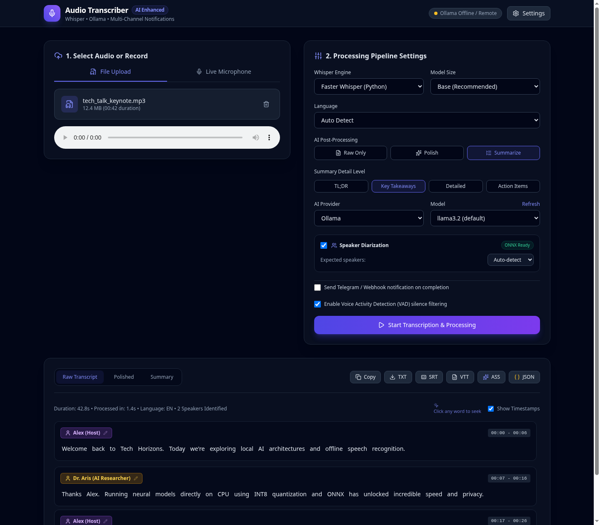

# Audio Transcriber & AI Summarizer

A modular audio transcription and AI analysis platform. Accepts audio/video media in any format, standardizes it to Whisper-optimized 16kHz mono WAV via FFmpeg, transcribes it with Whisper, polishes or summarizes it with selectable LLM models (Ollama or OpenAI-compatible), and dispatches notifications across multiple channels (Telegram, Webhooks).

<p align="center">
  
</p>

---

## Key Features

- **Universal Media Ingestion**: Supports `.mp3`, `.wav`, `.m4a`, `.ogg`, `.flac`, `.aac`, `.opus`, `.webm`, `.mp4`, `.mkv`, etc.
- **FFmpeg Standardization**: Automatically downmixes and resamples any container and codec to Whisper's ideal format: **16,000 Hz, 1-channel mono, 16-bit PCM WAV**.
- **Whisper Transcription Engine**:
  - `faster-whisper` (CTranslate2 with CPU `int8` quantization for fast, low-memory inference).
  - `whisper.cpp` standalone C++ binary runner with SHA256 verification and compilation fallback.
  - Generates plain text, timestamped interactive segments, and subtitle exports (**SRT**, **WebVTT**, **ASS**, **JSON**).
- **Speaker Diarization (ONNX)**:
  - Offline multi-speaker identification and dialogue turn segmentation powered by `sherpa-onnx` (Pyannote 3.0 segmentation + 3D-Speaker embedding neural networks).
  - 100% CPU inference with zero PyTorch or GPU requirements.
  - On-demand model provisioning: models are fetched automatically only when diarization is first requested.
  - Interactive inline speaker renaming that updates exports and dialogue turns in real time.
- **Live Real-Time Dictation (WebSockets)**:
  - Low-latency live microphone streaming over WebSockets (`/api/ws/transcribe`).
  - Sliding-window decoding with energy VAD and silence pause detection running asynchronously in background worker threads.
  - Interactive live UI displaying interim words in real time with visual audio equalizer waves and automatic handoff to full results export and AI processing.
- **Word-Level Precision & Karaoke Playback**:
  - Precise word-level timestamps with speech recognition confidence scores.
  - Real-time karaoke-style word highlighting synchronized with audio playback.
  - Click-to-seek navigation: clicking any word or timestamp instantly seeks the audio player to that exact moment.
- **Extensible AI Intelligence (Ollama, Groq, OpenRouter & Beyond)**:
  - **Cloud STT Acceleration**: Near-instant transcription using Groq Cloud Whisper (`whisper-large-v3-turbo`, `distil-whisper`) or OpenRouter, with automatic audio compression and chunking for files exceeding the 25MB API limit.
  - **Transcript Polish & Summarization**: Choose between local Ollama models or ultra-fast cloud LLMs (Groq Llama 3.3 70B, OpenRouter Claude/DeepSeek-R1, custom vLLM).
  - **Universal Profile-Driven Adapters**: Zero vendor-specific subclasses. Both STT and LLM integrations adhere to standard OpenAI REST specifications and can be plugged declaratively via `config.json` or the Settings UI.
  - **Interactive Settings & Connection Testing**: In-browser latency benchmarking and connection verification with masked credential security.
- **Modular Notification Dispatcher (Strategy Pattern)**:
  - **Telegram Bot**: Sends rich HTML notifications with execution stats, formatted summaries, and full transcript documents (`.txt` / `.md`).
  - **Generic Webhook**: Dispatches standard JSON POST payloads to automation workflows (n8n, Make, Zapier, Discord, Slack).
  - Open for extension: Add Slack, Email, or Discord providers without modifying core transcription code.
- **Modern Responsive Dashboard**:
  - Drag-and-drop file upload with format inspection.
  - In-browser microphone audio recorder with live WebSocket dictation.
  - Audio player with interactive timestamp seeking and word karaoke highlighting.
  - Clean dark theme built with Tailwind CSS and Lucide icons.
  - Zero Node/NPM dependencies needed to run.

---

## Quick Start

### 1. Automated Installation
The portable installer detects your system architecture (`x86_64` or `arm64`), checks FFmpeg, downloads Whisper models with SHA256 verification, and configures the Python virtual environment:

```bash
bash install.sh
```

### 2. Launch Application
Start the server on `http://localhost:8000`:

```bash
bash run.sh
```

---

## Configuration (`config.json`)

Copy `config.json.example` to `config.json` to customize your settings:

```bash
cp config.json.example config.json
```

| Variable | Default | Description |
| :--- | :--- | :--- |
| `HOST` | `0.0.0.0` | Server bind address |
| `PORT` | `8000` | Server HTTP port |
| `DEFAULT_WHISPER_MODEL`| `base` | Default Whisper model (`tiny`, `base`, `small`, `medium`) |
| `GROQ_API_KEY` | | Groq Cloud API Key for ultra-fast Whisper & Llama 3.3 |
| `OPENROUTER_API_KEY` | | OpenRouter API Key for cloud Whisper, Claude, DeepSeek |
| `OPENAI_API_KEY` | | OpenAI / Custom OpenAI-compatible API Key |
| `OLLAMA_BASE_URL` | `http://127.0.0.1:11434` | Local Ollama API endpoint |
| `DEFAULT_OLLAMA_MODEL` | `llama3.2` | Default model for polishing & summaries |
| `TELEGRAM_ENABLED` | `false` | Enable Telegram notification dispatch |
| `TELEGRAM_BOT_TOKEN` | | Telegram Bot Token from `@BotFather` |
| `TELEGRAM_CHAT_ID` | | Target Chat or Channel ID |
| `WEBHOOK_ENABLED` | `false` | Enable generic Webhook dispatch |
| `WEBHOOK_URL` | | HTTP POST endpoint for notifications |

---

## Telegram Setup Guide

1. Open Telegram and search for `@BotFather`.
2. Send `/newbot` and follow the instructions to get your **Bot Token** (e.g. `123456789:ABCdefGhIJKlmNoPQRstuVWXyz`).
3. Start a chat with your new bot and send `/start`.
4. Get your **Chat ID** by messaging `@userinfobot` or checking `https://api.telegram.org/bot<TOKEN>/getUpdates`.
5. Enter the Token and Chat ID in the Web UI **Settings** modal and click **Test Connection**.

---

## Running Automated Tests

Run the full regression test suite:

```bash
.venv/bin/pytest tests/ -v
```

---

## Architecture Overview

```
transcriber/
├── audio_processor.py         # FFmpeg universal conversion & media metadata probe
├── config.py                  # Zero-hardcoding, dynamic environment configuration
├── jobs.py                    # Job lifecycle management, semaphore concurrency, and SSE
├── main.py                    # FastAPI server & Server-Sent Events (SSE) streaming
├── install.sh                 # Architecture-aware installer with SHA256 validation
├── run.sh                     # Application runner
├── diarization/               # Lightweight Offline Diarization Subsystem (Sherpa-ONNX)
│   ├── base.py                # BaseDiarizer, SpeakerInterval & DiarizationResult DTOs
│   ├── sherpa_diarizer.py     # Pyannote 3.0 + 3D-Speaker ONNX runner (on-demand download)
│   ├── alignment.py           # Temporal overlap alignment mapping speakers to segments/words
│   └── factory.py             # Diarizer dynamic factory and engine registry
├── notifications/             # Modular Notification System (Open/Closed Principle)
│   ├── base.py                # BaseNotifier & NotificationPayload DTO
│   ├── telegram.py            # TelegramNotifier (auto-chunking & document attachments)
│   ├── webhook.py             # Generic WebhookNotifier
│   └── dispatcher.py          # Asynchronous concurrent dispatcher
├── transcribers/              # Pluggable Transcriber Subsystem
│   ├── base.py                # BaseTranscriber, TranscriptionResult (TXT, SRT, VTT, ASS, JSON)
│   ├── faster_whisper.py      # CTranslate2 Python engine
│   ├── whisper_cpp.py         # Standalone C++ binary adapter
│   ├── openai_compat.py       # Universal cloud STT adapter (Groq, OpenRouter, OpenAI, vLLM)
│   ├── streaming.py           # Real-time WebSocket audio ring buffer & live session
│   └── factory.py             # Dynamic transcriber resolution
├── llm/                       # Modular AI / LLM Subsystem
│   ├── base.py                # BaseLLMProvider interface
│   ├── ollama.py              # Ollama client with token streaming & model pulling
│   ├── openai_compat.py       # Universal OpenAI-compatible client (Groq, OpenRouter, vLLM)
│   ├── prompts.py             # Decoupled prompts (Polish + 5 summary tiers with speaker headers)
│   └── registry.py            # LLM provider registry
├── templates/
│   └── index.html             # Modern responsive web dashboard
├── static/
│   ├── app.js                 # UI controller, mic recording, SSE streams, live dictation
│   └── style.css              # Custom styling & animations
└── tests/                     # 48 automated tests covering all subsystems
```

---

## License

This project is licensed under the [MIT License](LICENSE).
